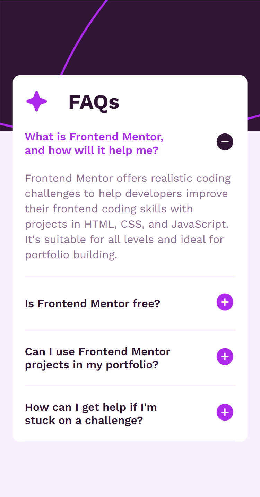
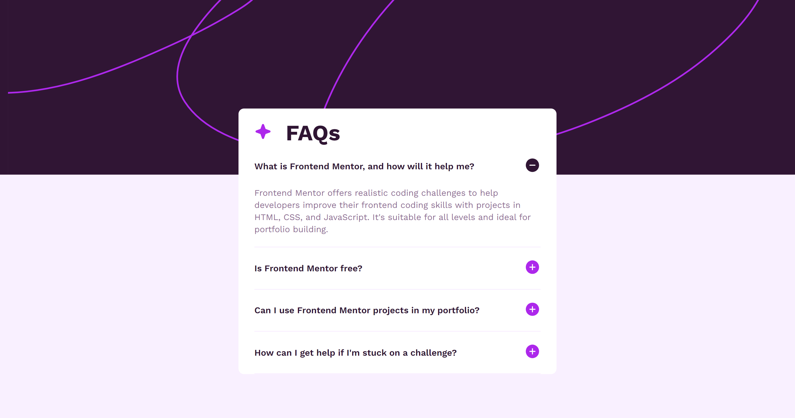

# Frontend Mentor - FAQ accordion solution

This is a solution to the [FAQ accordion challenge on Frontend Mentor](https://www.frontendmentor.io/challenges/faq-accordion-wyfFdeBwBz). Frontend Mentor challenges help you improve your coding skills by building realistic projects. 

## Table of contents

- [Overview](#overview)
  - [The challenge](#the-challenge)
  - [Screenshot](#screenshot)
  - [Links](#links)
- [My process](#my-process)
  - [Built with](#built-with)
  - [What I learned](#what-i-learned)
  - [Continued development](#continued-development)
  - [Useful resources](#useful-resources)
- [Author](#author)
- [Acknowledgments](#acknowledgments)

## Overview

### The challenge

Users should be able to:

- Hide/Show the answer to a question when the question is clicked
- Navigate the questions and hide/show answers using keyboard navigation alone
- View the optimal layout for the interface depending on their device's screen size
- See hover and focus states for all interactive elements on the page

### Screenshot





### Links

- Solution URL: [Add solution URL here](https://your-solution-url.com)
- Live Site URL: [Add live site URL here](https://your-live-site-url.com)

## My process

### Built with

- Semantic HTML5 markup
- CSS custom properties
- Flexbox
- Mobile-first workflow
- JavaScript

### What I learned

From this FAQ Project, I was able to put my JavaScript skills into action to show or hide the answer to a question. I got to learn how to make my responsiveness look much better and it took me not much time to build. Also, I learned that I don't have to use the Google Fonts link in my project once I'm given it. I learnt how to apply it.

Some codes that I'm proud of:

```html
<div class="purple"></div>
```
```css

@font-face {
    font-family: 'Work Sans';
    src: url('fonts/WorkSans-VariableFont_wght.ttf') format('ttf');
    font-style: normal;
    font-weight: 400, 600, 700;  
}
```
``` js
const toggleNextSiblingTextAndIcon = (cont) => {
    const nextSibling = cont.nextElementSibling;
    if (nextSibling && nextSibling.classList.contains('text')) {
        
    }
```

### Continued development

Work on more real-world problems to improve my JavaScript skills.

### Useful resources

- [W3Schools](https://www.w3schools.com) - This helped me in knowing how to use font face to display my fonts. I liked this pattern and will use it going forward.
- [ChatGpt](https://chatgpt.com) - This is an amazing app which helped me finally understand toggling. I'd recommend it to anyone still learning this concept.

## Author

- Frontend Mentor - [@Ijadele](https://www.frontendmentor.io/profile/Ijadele)
- Twitter - [@IjadeleO](https://www.twitter.com/IjadeleO)

## Acknowledgments

First and foremost, I acknowledge the Almighty God for completing this project. I am also proud of myself for dedicating my time and effort to achieve this goal.

I would like to express my heartfelt gratitude to Bro Audrey, Bro Tosin, and my mum for ensuring I had a good laptop to work with. Their support and provision were invaluable in the successful completion of this project.

Thank you all for your contributions to this achievement.
